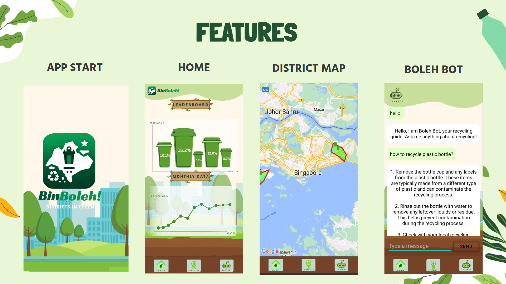

# RecyclingSG App

## Overview
🌲RecyclingSG is an Android application developed to encourage recycling in Singapore. The app provides users with information about recycling bins' locations, recycling tips, and a chatbot for any recycling-related inquiries.

##😍 Features
- **Recycling Chatbot**: An AI-driven chatbot developed using Java to answer user queries about recycling.
- **GPS Bin Locator**: Utilizes Google map API to locate recycling bins in singapore.
- **Real-time Data**: Uses Firebase for real-time data updating and processing.

## 🔨🔎Technologies Used
- **Java**: Core programming language for Android development.
- **Android Studio**: Integrated development environment (IDE) for Android app development.
- **Firebase**: Backend platform for real-time data handling and authentication.
- **GPS**: Location services for bin locator functionality.

  
  
  [Click here to view video 😎](https://www.youtube.com/watch?v=H0bLJd_8v0Y)

